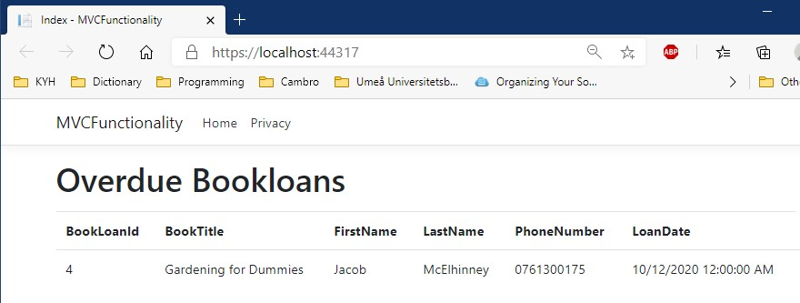

# CentrumBiblioteketRepository
Wepp Application for managing book loans

## Notes

This document contains a detailed description of the business logic in the newly added function.
For information regarding deployment, testing and futher technical or productrelated information please review 
the file titled "Dokumentation.pdf" in the zipped repository uploaded on "Google Classroom".

## New Function - GET: BookLoansOverdue

The following action method was defined and implemented to provide the desired functionality.
The codeblock is located in MVCFuntionality project Controllers/BookLoansOverdue.cs file on row 22.

        // GET: BookLoansOverdue
        public async Task<IActionResult> Index()
        {
            /*BookLoans are Overdue +30 days past LoanDate. The 'Where(Expression)' 
              filters out BookLoans that are not overdue as of DateTime.Now. */
            var centrumBiblioteketDbContext = _context.BookLoans.Where(bl => bl.LoanDate.AddDays(30) < DateTime.Now)
                .Include(b => b.BookCopy)
                .ThenInclude(b => b.BookEdition)
                .Include(b => b.LibraryCard);
            return View(await centrumBiblioteketDbContext.ToListAsync());
        }
        
Since the controller uses the BookLoans table in the database there is no need to store Book loans that are overdue in a separate table. Instead the HTTP request is configured in the pipeline resulting in a filtered respone which returns only the objects that satisfy the condition specified in the WHERE clause. This is achieved through the following LINQ expression:

                .Where(bl => bl.LoanDate.AddDays(30) < DateTime.Now) 
                
The expression can be read as: "For each book loan where Loan date plus an additional thirty days is still a lesser amout of time than the period between Loan date and date of today - return that object and add it to the collection 'centrumBiblioteket'.
Since the 'BookLoan' table includes a foreign key, referencing the 'BookEdition' table, additional data can be included in the viewmodel by chain calling the "ThenInclude()" method (LINQ). This operation equates to a SQL INNER JOIN query and allows for the viewmodel to incude additional related data in the razorpage view (BookLoansOverdue/index.cshtml). 

                .Include(b => b.BookCopy)
                .ThenInclude(b => b.BookEdition)
                .Include(b => b.LibraryCard);

In the index.cshtml view file The scaffolded razor html helpers then retrieve the field data via desired model (viewmodel) properties.

                <td>
                    @Html.DisplayFor(modelItem => item.BookCopy.BookEdition.BookTitle)
                </td>

The above code is an excerpt from row 42 in the above mentioned view file. The HTTP responce or view rendered to the user looks like this:

        
 
For futher questions and product specific details please review the documentation included in Root/Assets/Documentation/Dokumentation.pdf

